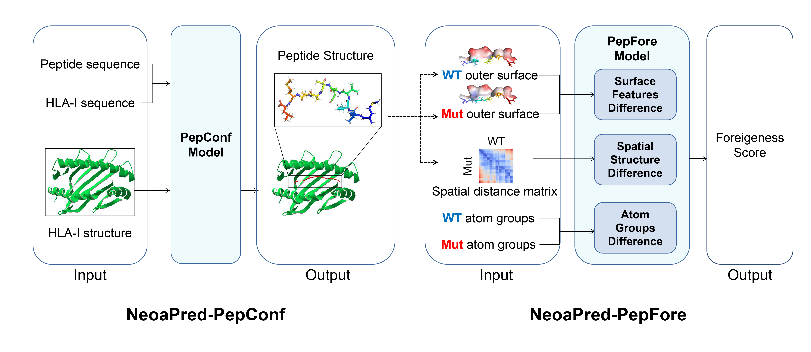
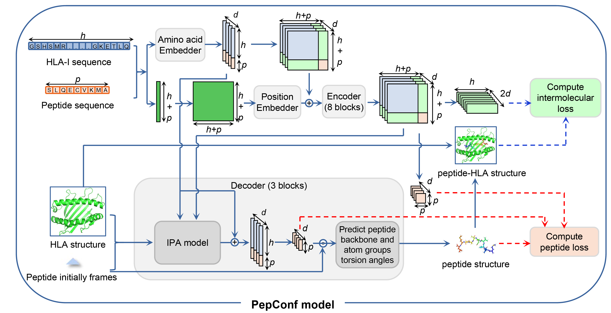
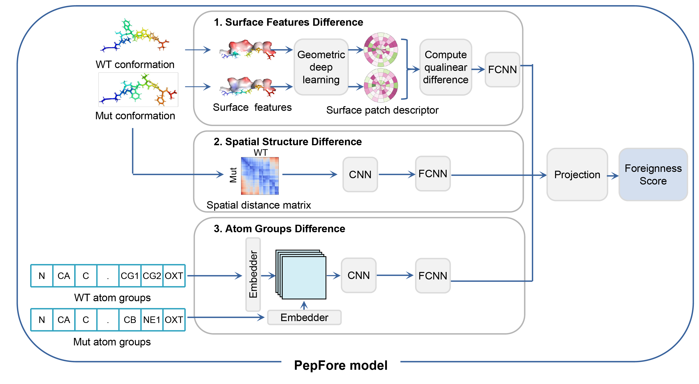
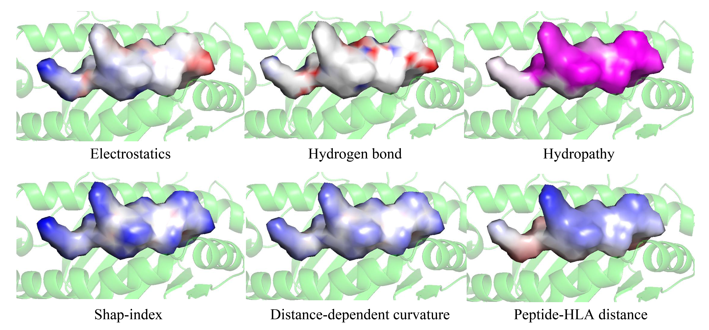

## NeoaPred: a deep-learning framework for predicting immunogenic neoantigen based on surface and structural features of peptide-HLA complexes  


## Table of Contents:
 - [Description](#Description)
      * [PepConf-Overview](#PepConf-Overview)
      * [PepFore-Overview](#PepFore-Overview)
 - [Installation](#Installation)
 - [Usage](#Usage)
      * [NeoaPred](#NeoaPred)
      * [NeoaPred-PepConf](#NeoaPred-PepConf)
      * [NeoaPred-PepFore](#NeoaPred-PepFore)
 - [PyMOL plugin](#PyMOL-plugin)
 - [HLA-I structure templates](#HLA-I-structure-templates)
 - [License](#License)


## Description
This package contains deep learning models and related scripts to run NeoaPred.  
NeoaPred includes two model: PepConf and PepFore.



### PepConf-Overview
PepConf utilizes the sequence of peptide and HLA-I, as well as the structure of HLA-I to construct the conformation of peptide binding to HLA-I. PepConf has two peculiarities: 1) The model computes a two-dimensional matrix to describe the spatial distance between the peptide and HLA-I molecule; 2) The model uses a intermolecular loss to achieve the constraints of spatial distance between peptide and HLA-I molecule.


### PepFore-Overview
PepFore integrates the differences in surface features, spatial structure, and atom groups between the mutant peptide and wild-type counterpart to predict a foreignness score. 


## Installation
Two methods exist to run NeoaPred:  
1.Docker  
2.Linux  
### Docker ####
```
docker pull xxxx/NeoaPred:1.0  
cmd=$(docker run -it -d xxxx/NeoaPred:1.0 /bin/bash)  
```
Copy prepared input file to the container:  
```
docker cp input.csv  $cmd:/input.csv
```
enter the container:  
```
docker exec $cmd
```
run the work script: 
```
python run_NeoaPred.py  
```
### Linux ####
1.Clone NeoaPred to a local directory

```
git clone https://github.com/DeepImmune/NeoaPred.git
cd NeoaPred
```

2.Create conda environment and prepare the required python package.  
You may choose either a conda YAML file-based approach: 
```
conda env create -f environment.yml -n my_environment_name
```
or a manual, step-by-step process:
* python=3.6
```
conda create -n my_environment_name python=3.6
conda activate my_environment_name
```

NeoaPred relies on external libraries/programs to handle PDB files and surface files,
to compute chemical/geometric features and coordinates, and to perform neural network calculations.
The following is the list of required libraries/programs.

* pytorch
```
conda install pytorch torchvision torchaudio pytorch-cuda=11.8 -c pytorch -c nvidia
```
* [Pymesh2](https://github.com/PyMesh/PyMesh) (0.1.14).  
To handle ply surface files, attributes, and to regularize meshes. Only python 3.6 is supported.
```
conda install -c "conda-forge/label/cf202003" pymesh2
```
* [BioPython](https://github.com/biopython/biopython) (1.78).  
To parse PDB files.
```
conda install -c conda-forge biopython
```
* [PeptideConstructor](https://github.com/CharlesHahn/PeptideConstructor) (0.2.1).  
Create an initial peptide PDB file.
```
pip install PeptideConstructor
```
* [ml_collections](https://github.com/google/ml_collections) (0.1.1).  
ML Collections is a library of Python collections designed for ML usecases.
```
pip install ml_collections
```
* [importlib-resources](https://github.com/python/importlib_resources) (5.4.0).  
Read resources from Python packages.
```
pip install importlib-resources
```
* [openmm](https://openmm.org) (7.6.0).  
Required by pdbfixer.
```
conda install openmm
```
* [pdbfixer](https://github.com/openmm/pdbfixer) (1.8.1).  
Fixing problems in predicted structure of peptides.
```
conda install -c conda-forge pdbfixer
```
* dm-tree
```
conda install dm-tree
```
* modelcif
```
pip install modelcif
```
* einops
```
pip install einops
```
* pytorch_lightning
```
pip install pytorch_lightning
```
* sklearn
```
pip install sklearn
```
* networkx
```
pip install networkx==2.5.1
```
3.Prepare the required software. 
* [reduce](https://github.com/rlabduke/reduce). To add protons to proteins.
* [MSMS](http://mgltools.scripps.edu/packages/MSMS/) (2.6.1). To compute the surface of proteins.
* [APBS](https://www.poissonboltzmann.org/) (3.0.0),[PDB2PQR](https://anaconda.org/schrodinger/pdb2pqr/) (2.1.1) and multivalue. These programs are necessary to compute electrostatics charges.  
#APBS  
APBS can be obtained from this website: https://www.poissonboltzmann.org/   
We have also prepared a Linux version of the binary software in the repository in case you are unable to download it: [APBS-3.0.0.Linux](./APBS-3.0.0.Linux/)
#PDB2PQR  
```
conda install schrodinger::pdb2pqr
conda install schrodinger/label/archive::pdb2pqr
```
**Note**: multivalue can be found in the installation path of APBS.

4.After preinstalling dependencies, add the following environment variables to your path, changing the appropriate directories:

```
export LD_LIBRARY_PATH=/path_to_conda3/lib:/path_to_apbs/lib/:$LD_LIBRARY_PATH

export APBS_BIN=/path_to_apbs/bin/apbs
export MULTIVALUE_BIN=/path_to_apbs/share/apbs/tools/bin/multivalue

export PDB2PQR_BIN=/path_to_conda3/envs/name/bin/pdb2pqr
export MSMS_BIN=/path_to_msms/msms
export PDB2XYZRN=/path_to_msms/pdb_to_xyzrn
```
**Note**:  
```path_to_conda3``` is the installation directory of conda.  
```path_to_apbs``` is the installation directory of APBS.  
```/path_to_conda3/envs/name/bin/pdb2pqr``` is the installation path of pdb2pqr, which can be found in the environment directory within conda, e.g., "/var/software/miniconda3/envs/neoa/bin/pdb2pqr"  
```path_to_msms``` is the installation directory of MSMS.  

## Usage
### NeoaPred  
```
python run_NeoaPred.py --help
usage: run_NeoaPred.py [-h] --input_file INPUT_FILE [--output_dir OUTPUT_DIR]
                       [--mode MODE] [--trained_model_1 TRAINED_MODEL_1]
                       [--trained_model_2 TRAINED_MODEL_2]

optional arguments:
  -h, --help            show this help message and exit
  --input_file          Input file (*.csv)
  --output_dir          Output directory (default = ./)
  --mode                Prediction mode (default = PepFore)
                        PepConf: Predict the conformation of peptide binding to the HLA-I molecule.

                        PepFore: Predict the conformations of Mut and WT peptides,
                                 compute the features of peptides surface,
                                 and compute a foreignness score between Mut and WT.

  --trained_model_1     Pre-trained model for PepConf.
                        (default = NeoaPred/PepConf/trained_model/model_1.pth)
  --trained_model_2     Pre-trained model for PepFore.
                        (default = NeoaPred/PepFore/trained_model/model_2.pth)
```

### NeoaPred-PepConf  
For peptide conformation prediction, you can:
```
python run_NeoaPred.py --input_file test_1.csv --output_dir test_out_1 --mode PepConf
```
or   
```
python run_NeoaPred.py --input_file test_2.csv --output_dir test_out_2 --mode PepConf
```
Input file: ```test_1.csv``` or ```test_2.csv``` ('.csv' format)  
```
#Input files example: test_1.csv
ID,Allele,Pep
id_0,A2402,ELKFVTLVF
id_1,A2402,RYTRRKNRQ
id_2,A1101,SSKYITFTK

#Input files example: test_2.csv
ID,Allele,WT,Mut
ID_0,A2402,ELKFVTLVF,KLKFVTLVF
ID_1,A2402,RYTRRKNRQ,RYTRRKNRI
ID_2,A1101,SSKYITFTK,SSKYVTFTK
```

Output file:  
The out results will be generated in ```test_out/Structure```:  
```*.relaxed_pep.pdb``` is the predicted conformation of peptide.  

```*.relaxed.pdb``` is the structure of pHLA complex.


### NeoaPred-PepFore
For peptide foreignness score prediction, you can:
```
python run_NeoaPred.py --input_file test_2.csv --output_dir test2_foreignness_score --mode PepFore
```
Input file: ```test_2.csv``` (must contain two columns: 'WT' and 'Mut')  
```
#Input files example: test_2.csv
ID,Allele,WT,Mut
ID_0,A2402,ELKFVTLVF,KLKFVTLVF
ID_1,A2402,RYTRRKNRQ,RYTRRKNRI
ID_2,A1101,SSKYITFTK,SSKYVTFTK
```
Output files:   
```test2_out/Surface/Feat/*_si_ddc_dm.ply```(surface features of peptide)  

```test2_out/Foreignness/MhcPep_foreignness.csv```(foreignness score)

## PyMOL plugin

A PyMOL plugin to visualize protein surfaces.  
This plugin was developed by MaSIF and had some modifications made by NeoaPred.  
Please see the MaSIF's tutorial on how to install and use it:
[MaSIF: https://github.com/LPDI-EPFL/masif]

## HLA-I structure templates
Structure templates of 200 HLA-I alleles are stored in ```NeoaPred/PepConf/data/MHC_template_PDB```.
The numbers of HLA-A, HLA-B, and HLA-C alleles are 66, 105, and 29.
To simplify the PepConf model and focus on the HLA-I binding groove domain, 
we only retained the residues of HLA-I from 1 to 180.

## License

NeoaPred is released under an [Apache v2.0 license](LICENSE).

